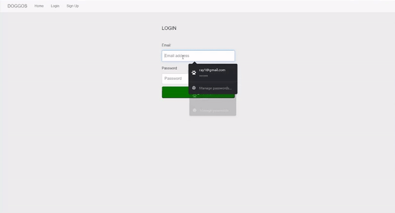
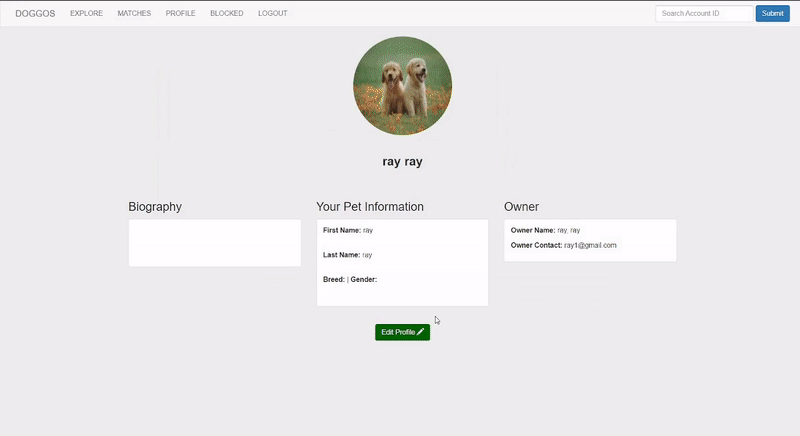

# Doggos
## [Link](https://doggos.herokuapp.com/) 
## Introduction
Doggos is a social media app that allows lonely pet owners match their pets with others, maintaining a healthy relationship with the owners as well as their pets.
* Backend
  * PostgreSQL - v.10.12
  * ExpressJS - v.4.17.1
* Frontend
  * HTML5
  * Bootstrap - v.3.4.1
* Cloud platforms
  * Docker
  * Heroku
## Functionality
* Users are able to signup, login, and logout.
* Users are able to explore, accept, block and unblock matches.
* Users can edit their profile, and change their picture.
### Login/Logout

The website will prompt the user to login when the login button is clicked. The website will then verify the login credentials provided by sending a request to the backend to check if the username and password both match.
```
exports.login = function(request, response){
    var browser_user = request.session.userId;
    message = '';
    var sess = request.session; 
    if(request.method == "POST" && browser_user == null){
        var post  = request.body;
        var username = post.email;
        var password= post.password;
        pool.query('SELECT * FROM public.user_accounts WHERE (email = $1);', [username], function(error, results, fields) {
            if (results.rowCount > 0) {
                if(passwordHash.verify(password,results.rows[0].password) === true){
                    request.session.userId = results.rows[0].account_id;
                    request.session.user = results[0];
                    response.redirect('profile');
                    response.end();
                }
                else{
                    message = "loginfail";
                    response.render('login',{message: message});
                }
         } 
         else{
             console.log("Erorr no email");
             message = "loginfail";
             response.render('login',{message: message});
         }			
         response.end();
     });
     } else if(request.method == "GET" && browser_user == null) {
         response.render('login');
     }
     else{
         response.redirect('/logout');
     }

    module.exports = message;
};
```
An error will be displayed if there is no valid user.
### Edit Profile

The User may choose to change their profile picture under the Profile section of the navigation bar. You may change other account information as well including password and your name.
```
app.post('/upload', upload.single('avatar'), function (req, res, next) {

    
  if(req.file === undefined){

    message = "File Not Supported";
    res.render("editprofile",{message:message});
  }
pool.query('UPDATE public.user_accounts SET profile_picture= $1 WHERE account_id = $2;', [req.file.filename,req.session.userId], function(error, results, fields) {
  if (error) {
      message = "profupdatefailed";
      res.render("editprofile",{message:message});
      console.log(error);
          
      }
      else{
          message = "profupdatesuccess";
          res.render('editprofile',{message: message});
      }   
      res.end();
  });

  
});
```
### Explore/Block/Unblock

In the Explore page, there is a list of users that have created an account on the website, clicking "Accept" would send them to the Matches page, clicking "Block" would send them to the Blocked page and clicking "Unblock" would send them back to the Explore Page. There is also a View Profile button that shows the information of the user.
```
exports.explore = function(request, response){
    var browser_user = request.session.userId;
    if(browser_user == null){
       response.redirect("/login");
    }
    else{
    
        // get first and last name of current user (owner)
        pool.query('SELECT owner_first_name, owner_last_name FROM public.user_accounts WHERE account_id=$1;', [browser_user], function(error, results, fields){
            var first_name_owner = results.rows[0].owner_first_name;
            var last_name_owner = results.rows[0].owner_last_name;        

            
            pool.query('SELECT * FROM public.matches WHERE (matcher_first_name=$1 AND matcher_last_name=$2);', [first_name_owner, last_name_owner], function(error, results, fields) {      
                if (results.rowCount > 0) {
                    // console.log(results.rows[0].matched_id);
                    message = "loginpass";
                    response.render('explore',{data: results.rows});
                } else{

                    // make another page for no matches?
                    //response.send("No matches");
                     response.redirect("/explore_matches");
                }			
                response.end();
            });

        });
    }       
};
```